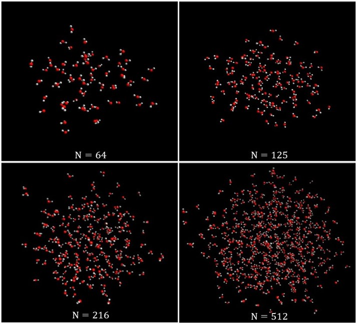
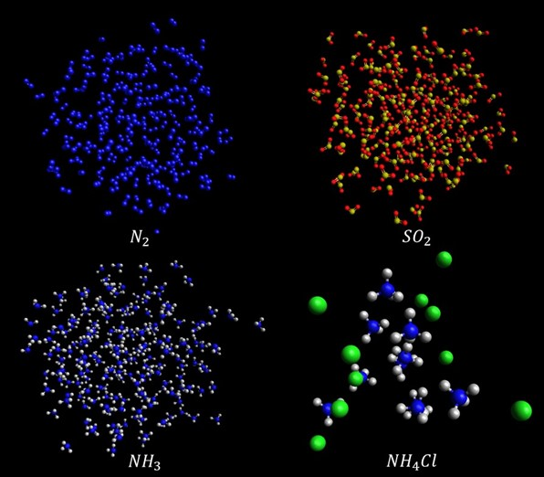

# Simulated Annealing Program: Object Oriented Python Program to Study Molecular Clusters

  
     
 <b> Lowest Energy Configurations of Ammonium Chloride Clusters </b>

### This program simulates system at fixed temperatures or perfroms simulated annealing using a modified Metropolis-Hastings algorithm.  Mag-walking Monte Carlo is used to sample configurations of a cluster system. The program can pure or mixed species systems.  

<strong> Abstract from paper submission</strong>: This paper describes an object-oriented Python programming project designed to perform simulated annealing Monte Carlo simulations of molecular clusters and thereby find the lowest energy geometry of each cluster. Clusters studied include homogeneous systems consisting of a single species and heterogeneous systems consisting of multiple species. Example studies were performed on water clusters [(H2O)n, n = 2,…,5] and clusters of ammonium chloride [(NH4Cl)n, n = 1,2 and 4]. Simulations are performed using mag-walking to ensure ergodic sampling and molecules are treated as rigid bodies. A comparison with previous studies shows that the cluster geometries and conformer energies obtained from the program agree well with literature values. This project will ultimately result in the public release of the first simulated annealing Monte Carlo program which includes mag-walking.

### Example Systems:

     
 <b> Water Clusters of Different Sizes </b>

 

     
 <b> Configurations of Nitrogen, Sulfur Dioxide, Ammonia, and Ammonium Chloride </b>

